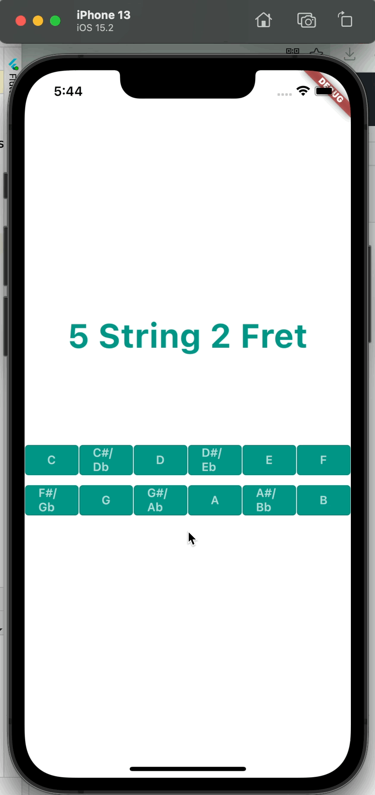

# Fretboard Notes

A Flutter project to help you to remember all notes on guitar fretboard. This project is inspired by [this website](https://www.guitarorb.com/guitar-notes).

## Usage

## TODO
- [ ] Add alternative tuning   
- [ ] Add fretboard over 12

## License
GPL 3

